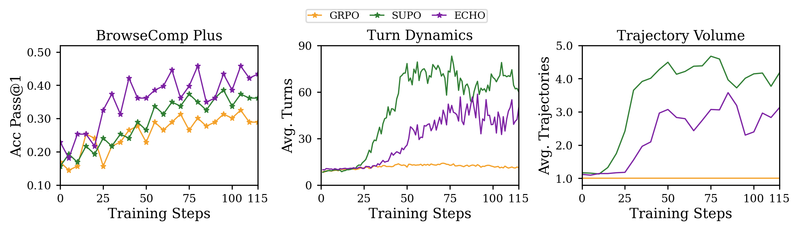
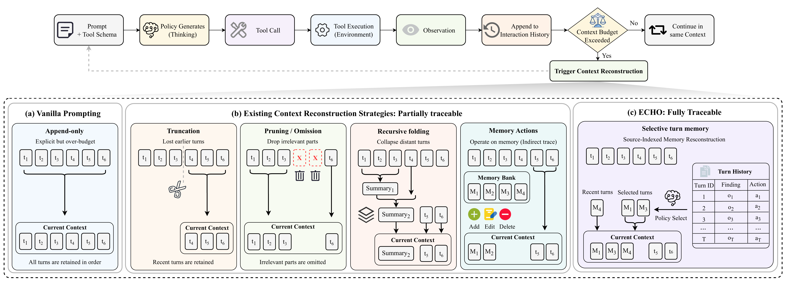
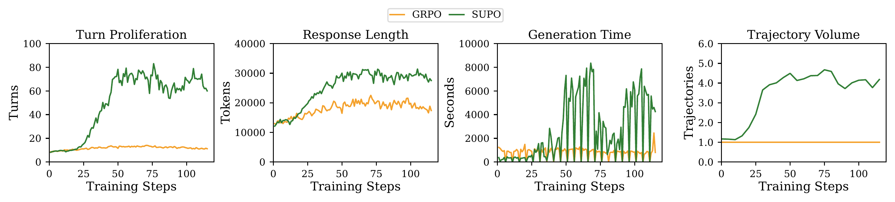
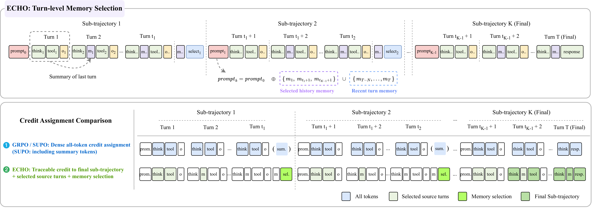
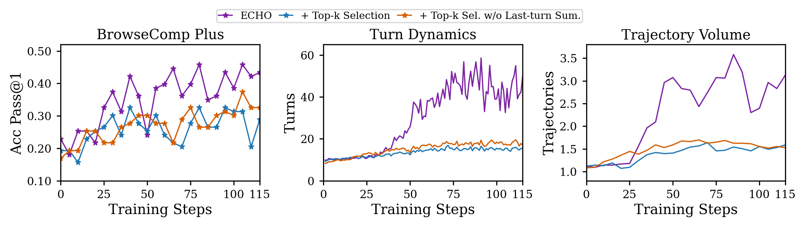
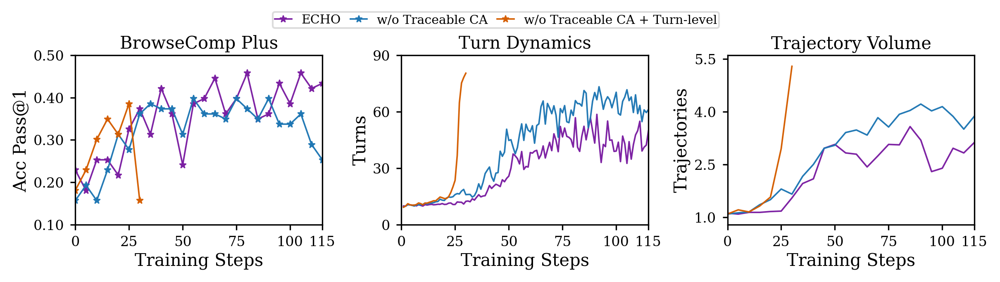
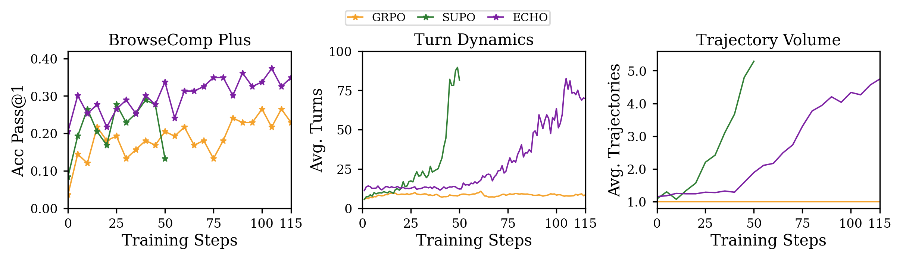

<div align="center">

# ECHO: Prune to Act, Trace to Learn with Selective Turn Memory in Agentic RL

</div>

ECHO is a selective turn-memory framework for traceable context reconstruction in
agentic reinforcement learning, built on top of [verl](https://github.com/volcengine/verl).

Long-horizon language agents must act under bounded contexts while learning from
sparse outcome rewards. Common context-management methods make long rollouts
feasible by truncating history or folding multiple turns into rolling summaries,
but these transformations lose source-level addressability: once historical
observations are collapsed, outcome-based RL has no explicit route for assigning
delayed credit back to the original evidence turns that later decisions
conditioned on.

ECHO addresses this with two coupled ideas:

- **Prune to Act** — each completed turn is compressed into a *source-indexed*
  memory; distant history is kept as a non-collapsing memory set, and a bounded
  policy context is reconstructed by selecting relevant memories together with
  recent interactions.
- **Trace to Learn** — the selected source indices are reused as provenance
  routes for delayed credit assignment, so learning rewards the final segment and
  the useful historical memory tokens instead of all generated tokens.

<div align="center">

</div>

> **Figure 1 — Training dynamics on BrowseComp-Plus** (ECHO = purple, GRPO =
> orange, SUPO = green), under an identical backbone, verifier, rollout budget,
> and sampling configuration. **Left:** held-out pass@1 accuracy over training.
> **Middle:** average tool-use turns per rollout. **Right:** trajectory volume
> (total generated tokens) per rollout. ECHO traces the upper-left frontier —
> rising accuracy *without* the turn and volume growth seen for SUPO.

On BrowseComp-Plus, ECHO reaches **43.4%** held-out accuracy, outperforming GRPO
(28.9%) and the rolling-summary baseline SUPO (36.1%), while using fewer turns and
lower trajectory volume than SUPO. The trained policy also improves zero-shot
generalization across multi-objective QA, code generation, and deep
information-seeking benchmarks on both dense (Qwen3-32B) and MoE (Qwen3-30B-A3B)
backbones.

## Method

ECHO has two coupled stages: it **prunes** distant history into a selectable,
source-indexed memory so the policy can keep acting under a bounded context, and
it **traces** the same source indices back through the update so credit flows only
to the turns the policy actually reused.

### Motivation

<div align="center">

</div>

> Collapsing history into a rolling summary makes bounded-context acting possible
> but removes direct source-level addressability — once turns are folded into one
> summary, outcome-based RL has no route to credit the original evidence turns.
> ECHO instead compresses **each completed turn independently** into a compact,
> source-indexed memory clue, and keeps the distant history as a *non-collapsing*
> set: every memory stays individually linked to its source turn even after the
> raw observation leaves the active context. At a compression boundary the policy
> autoregressively **selects** which historical memories to reuse, and reconstructs
> a bounded context from the selected memories plus the most recent turns. The
> selected source indices are kept as an explicit provenance set — the trace later
> reused for learning.

<div align="center">

</div>

> Training diagnostics on long-horizon search. Summarization-based context
> management enables longer rollouts, but also drives turn proliferation, longer
> responses, higher generation time, and inflated trajectory volume — motivating a
> reconstruction scheme that stays compact while remaining source-traceable.

### Credit assignment

<div align="center">

</div>

> **Overview of ECHO.** GRPO and SUPO apply the trajectory advantage *densely* to
> all generated tokens (in SUPO, including the rolling-summary tokens), so once the
> outcome reward arrives they cannot tell evidence turns from redundant searches.
> ECHO instead reuses the reconstruction trace as a credit route. It builds a
> token-level credit mask that keeps **(i)** the final-answer segment, **(ii)** the
> action tokens of selected source turns, **(iii)** the finding tokens of selected
> turns, and **(iv)** the memory-selection tokens; all other tokens are masked out.
> An outcome-dependent advantage is attached only to those credit tokens, using the
> *positive part* of the group-relative advantage: a correct rollout reinforces the
> evidence path the policy chose to reuse, while an incorrect rollout — whose trace
> carries no reliable signal — receives no update. (Dense all-token credit is kept
> only as the "w/o traceable CA" ablation.)


## Installation

Reference environment used for the paper:

- Python 3.10, CUDA 12.8
- GPU: NVIDIA H800 (80GB), 8 GPUs per node
- PyTorch 2.7.1+cu128, sglang 0.4.10, megatron-core 0.13.2
- transformer_engine 2.5.0, flash_attn 2.7.4.post1, flashinfer 0.2.6.post1

The CUDA-compiled stack (torch / sglang / megatron-core / transformer_engine /
flash_attn / flashinfer / apex) must be installed in order against your CUDA
toolkit — see [`requirements-cuda.txt`](requirements-cuda.txt) for the pinned
versions and suggested install order. After the CUDA stack is in place:

```bash
pip install -r requirements.txt
pip install -e .
```

## Data preparation

ECHO is trained and evaluated on
[BrowseComp-Plus](https://github.com/texttron/BrowseComp-Plus). Build the prompt
parquet files with:

```bash
python3 examples/data_preprocess/bcp_paper_prompt.py
```

This produces `train.paper.parquet` and `test.paper.parquet` under your dataset
directory. A dense retrieval service over the BrowseComp-Plus corpus is launched
automatically by the training scripts
(`examples/sglang_multiturn/browsecomp_retrieval_server.py`).

## Training

The scripts target a 4-node × 8×H800 setup with the Megatron backend and SGLang
rollout. Before launching, export the required paths (scripts fail fast if these
are unset):

```bash
export VENV_PATH=/path/to/your/venv               # Python virtualenv
export MODEL_PATH=/path/to/Qwen3-32B              # policy model
export RETRIEVER_MODEL_PATH=/path/to/Qwen3-Embedding-8B
export DATA_DIR=/path/to/browsecomp-plus-processed  # contains *.paper.parquet

# Optional services / accounts
export WANDB_API_KEY=...   export WANDB_ENTITY=...   # if using Weights & Biases
```

**LLM-judge reward.** The reward function (`verl/utils/reward_score/bc_p_llm_judge.py`)
scores answers with an OpenAI-compatible chat-completions endpoint. Point it at any
compatible API (OpenAI, DeepSeek, a self-hosted vLLM/SGLang server, etc.) via:

```bash
export BCP_JUDGE_API_BASE="https://api.openai.com/v1"   # any OpenAI-compatible base URL
export BCP_JUDGE_MODEL="gpt-4o-mini"                     # judge model name on that endpoint
export BCP_JUDGE_API_KEY_ENV="OPENAI_API_KEY"           # name of the env var holding the key
export OPENAI_API_KEY="sk-..."                          # the key itself (name must match above)
```

The script reads the key from the environment variable named by
`BCP_JUDGE_API_KEY_ENV` (default `ONEAPI_KEY`) and fails fast if it is unset, so
there are no hardcoded credentials. Use your own provider and key.

For multi-node runs, the node list is resolved by `bcp_node_utils.sh` from
`TRAINER_IPS` (or the cluster-provided `PADDLE_TRAINERS`).

Available scripts in `examples/sglang_multiturn/`:

- `run_qwen3-32b_bcp_echo-ca_4node.sh` — ECHO (synchronous)
- `run_qwen3-32b_bcp_echo-ca_fully_async_4node.sh` — ECHO (fully async)
- `run_qwen3-32b_bcp_grpo_4node.sh` — GRPO baseline (synchronous)
- `run_qwen3-32b_bcp_grpo_fully_async_4node.sh` — GRPO baseline (fully async)
- `run_qwen3-30b-a3b_bcp_echo-ca_fully_async_4node.sh` — ECHO on the MoE backbone
- `run_qwen3-30b-a3b_bcp_grpo_fully_async_4node.sh` — GRPO on the MoE backbone
- `run_qwen3-32b_bcp_supo_4node.sh` — SUPO rolling-summary baseline (synchronous)

Run from the project root, e.g.:

```bash
bash examples/sglang_multiturn/run_qwen3-32b_bcp_echo-ca_fully_async_4node.sh
```

### Reproducing ablations

Ablation variants reuse the same core scripts and are toggled through environment
variables (see the top of each script for the full list). Key knobs:

| Variable | Default | Meaning |
| --- | --- | --- |
| `CONTEXT_COMPRESSION_METHOD` | `echo_e2e` | Context reconstruction strategy: `echo_e2e` (learned selection), `semantic_selection` (static top-k retrieval), `truncate` (left-truncation), `summarize` (SUPO rolling summary) |
| `ECHO_CREDIT_METHOD` | `token` | Credit routing: `token` (provenance-guided, ECHO), `traj` (trajectory-level), `none` (dense, all tokens) |
| `ECHO_RECENT_TURNS` | `3` | Number of most-recent turns always kept during reconstruction |
| `WORKING_CONTEXT_LENGTH` | `32768` | Single-segment token threshold that triggers compression |
| `MAX_SUMMARY_ROUNDS` | `5` | Max compression rounds before a rollout is marked overlong |
| `SEMANTIC_SELECTION_FULL_OBSERVATION` | `False` | When using `semantic_selection`, retrieve full observations instead of compact findings |
| `ECHO_CREDIT_PENALTY_RATIO` | `0.0` | Down-weight (vs. 1.0 for credited tokens) applied to non-credited tokens |

Examples reproducing paper ablations (all on top of the ECHO async script):

```bash
# Full ECHO (paper main): learned selection + provenance-guided token credit
bash examples/sglang_multiturn/run_qwen3-32b_bcp_echo-ca_fully_async_4node.sh

# Ablation: static semantic top-k retrieval instead of learned selection
CONTEXT_COMPRESSION_METHOD=semantic_selection \
  bash examples/sglang_multiturn/run_qwen3-32b_bcp_echo-ca_fully_async_4node.sh

# Ablation: semantic top-k retrieving full observations (not compact findings)
CONTEXT_COMPRESSION_METHOD=semantic_selection SEMANTIC_SELECTION_FULL_OBSERVATION=True \
  bash examples/sglang_multiturn/run_qwen3-32b_bcp_echo-ca_fully_async_4node.sh

# Ablation: w/o traceable credit assignment (dense credit on all tokens)
ECHO_CREDIT_METHOD=none \
  bash examples/sglang_multiturn/run_qwen3-32b_bcp_echo-ca_fully_async_4node.sh

# SUPO baseline (rolling summarization) — synchronous script
bash examples/sglang_multiturn/run_qwen3-32b_bcp_supo_4node.sh
```

## Results

### Ablations

<div align="center">


</div>

> **Left — Memory component ablation.** Held-out accuracy vs. training, comparing
> ECHO's learned source selection against static semantic top-k retrieval, and
> compact last-turn findings against full observations. Learned selection is the
> main driver of accuracy; semantic top-k stays compact but plateaus lower, and
> full observations add no gain over compact findings.
>
> **Right — Credit assignment ablation.** ECHO's provenance-guided token credit
> vs. dense credit (w/o traceable CA, rewards all tokens) and all-turn importance
> weighting. Dense credit lowers accuracy and stability; all-turn weighting
> further inflates turn counts. Traceable credit gives the best accuracy/stability.

### MoE backbone

<div align="center">

</div>

> **Transfer to the sparse MoE backbone (Qwen3-30B-A3B).** Held-out accuracy over
> training for ECHO vs. GRPO, showing the method's gains are not specific to the
> dense backbone.

### Zero-shot generalization

Without any additional tuning, the BrowseComp-Plus–trained policy is evaluated
across three out-of-domain families: Multi-Objective QA (2–16 objectives), Code
Generation (CodeGym, LoCoBench-Agent), and Deep Information Seeking (GAIA, HLE,
Frames). **Bold** = best, _underline_ = second-best. CA = credit assignment.
Column abbreviations: **MO-Avg** = Multi-Objective QA average; **LoCo** =
LoCoBench-Agent.

**Backbone: Qwen3-32B-Instruct**

| Method | 2-obj | 4-obj | 8-obj | 16-obj | MO-Avg | CodeGym | LoCo | GAIA | HLE | Frames | Avg |
| --- | --- | --- | --- | --- | --- | --- | --- | --- | --- | --- | --- |
| GRPO | 38.6 | 39.8 | 35.8 | 29.0 | 35.8 | 32.8 | 67.7 | _25.2_ | 8.8 | 24.8 | 33.6 |
| SUPO | 40.9 | 36.4 | 36.4 | 34.7 | 37.1 | 35.4 | 68.1 | _25.2_ | 9.2 | 26.8 | 34.8 |
| **ECHO** | **47.7** | _45.5_ | **41.5** | **36.1** | **42.7** | **41.4** | **70.4** | **29.1** | **11.4** | **39.1** | **40.2** |
| ECHO w/ Top-K retrieval | **47.7** | 42.0 | _39.2_ | 27.8 | _39.2_ | _40.7_ | 69.3 | **29.1** | _10.6_ | _37.3_ | _38.2_ |
| ECHO w/ Top-K retrieval & w/o turn summary | 40.9 | 44.3 | 35.8 | _35.5_ | 39.1 | 40.3 | 69.5 | 23.3 | 10.0 | 31.3 | 36.8 |
| ECHO w/o traceable CA | _45.5_ | 42.0 | _39.2_ | 22.7 | 37.4 | 38.1 | 68.2 | _25.2_ | 8.8 | 30.8 | 35.6 |
| ECHO w/ all-turn CA | _45.5_ | **47.7** | 35.2 | 27.0 | 38.8 | 34.6 | _70.1_ | 23.3 | 9.4 | 32.2 | 36.1 |

**Backbone: Qwen3-30B-A3B-Instruct**

| Method | 2-obj | 4-obj | 8-obj | 16-obj | MO-Avg | CodeGym | LoCo | GAIA | HLE | Frames | Avg |
| --- | --- | --- | --- | --- | --- | --- | --- | --- | --- | --- | --- |
| GRPO | _27.3_ | 26.1 | _27.3_ | 16.2 | 24.2 | 20.3 | _65.7_ | _23.3_ | 7.8 | _19.1_ | 25.9 |
| SUPO | 25.0 | _30.7_ | _27.3_ | _18.2_ | _25.3_ | _27.3_ | 65.1 | _23.3_ | _8.0_ | 17.0 | _26.9_ |
| **ECHO** | **34.1** | **36.4** | **30.1** | **18.8** | **29.9** | **29.7** | **66.8** | **24.3** | **9.2** | **25.0** | **30.5** |

## Acknowledgements

ECHO is built on [verl](https://github.com/volcengine/verl) (Volcano Engine
Reinforcement Learning for LLMs). We thank the verl team and community.

## Citation

```bibtex
@article{echo,
  title  = {ECHO: Prune to Act, Trace to Learn with Selective Turn Memory in Agentic RL},
  author = {Xie, Zijun and Zheng, Binbin and others},
  year   = {2026}
}
```
