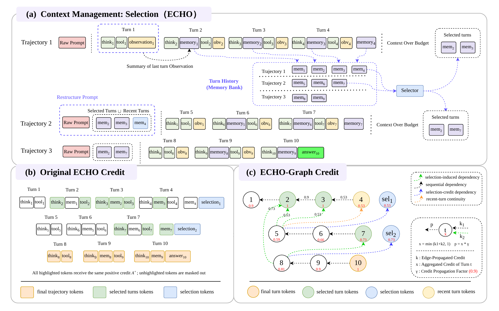

# ECHO-Graph

ECHO-Graph is a context-managed training stack for long-horizon search and tool-use agents. It extends `verl` with a selector, a turn memory bank, and graph-based credit assignment so a rollout can continue after its raw context reaches the model limit without treating every generated token as equally responsible for the final outcome.

<p align="center">
  
</p>

The figure shows the three parts of the method:

- **Context selection:** when a trajectory crosses the working-context limit, the selector chooses useful historical turns from the memory bank and combines them with the most recent turns to rebuild the next prompt.
- **Trajectory reconstruction:** each reconstructed continuation is emitted as a trainable trajectory segment, while the original turns and selector decisions remain in the rollout metadata.
- **Graph credit:** sequential turns and selection-induced dependencies form a sparse typed graph. Credit from the verified final answer is propagated over that graph with separate turn and segment discounts, configurable aggregation, and optional clipping.

## Scope of this checkout

This branch is the runnable **single-node Blackwell** checkout for BrowseComp-Plus:

- one node with eight Blackwell B cards;
- Qwen3-32B policy/reference models with the Megatron backend;
- SGLang rollout and the BrowseComp retrieval tool;
- ECHO-Graph, ECHO-v1 token credit, and a GRPO baseline.

Hopper multi-node launchers and unrelated experiments are intentionally outside this checkout. Logs, checkpoints, model weights, retrieval caches, and the local dataset are machine-local and ignored by Git.

## Quick start

Use the prepared Python 3.10 environment on the training machine, or create an equivalent environment and install the pinned packages:

```bash
python3.10 -m venv /path/to/venv_echo_blackwell
source /path/to/venv_echo_blackwell/bin/activate
pip install -r requirements.txt
```

Create the local configuration and fill in the model, dataset, retrieval-cache, and judge paths:

```bash
cp env/bcp.env.example env/bcp.env
$EDITOR env/bcp.env
```

Then run one of the launchers from the repository root:

```bash
bash scripts/run_bcp_echo_graph_1node_blackwell.sh
```

The launchers add this checkout to `PYTHONPATH`; no editable install is needed. This repository deliberately has no `setup.py` or `pyproject.toml`.

## Training entrypoints

| Launcher | Training mode |
| --- | --- |
| `scripts/run_bcp_echo_graph_1node_blackwell.sh` | ECHO-Graph graph credit (`ECHO_CREDIT_METHOD=graph`) |
| `scripts/run_bcp_echo_v1_1node_blackwell.sh` | ECHO-v1 token credit (`ECHO_CREDIT_METHOD=token`) |
| `scripts/run_bcp_grpo_1node_blackwell.sh` | GRPO baseline (`ECHO_CREDIT_METHOD=none`) |

The ECHO-v1 and GRPO scripts are thin wrappers around the shared Blackwell launcher. Common settings can be supplied through `env/bcp.env` or the process environment, including `VENV_PATH`, `MODEL_PATH`, `DATA_DIR`, `RETRIEVER_MODEL_PATH`, `RETRIEVER_DENSE_CACHE`, `EXPERIMENT_NAME`, `CKPT_DIR`, and `BCP_ENV_FILE`. To override the experiment name without editing a script:

```bash
bash scripts/run_bcp_echo_graph_1node_blackwell.sh \
  --bcp-experiment-name qwen3-32b-bcp-echo-graph-debug
```

The launcher writes runtime logs under `logs/` and checkpoints under `ckpt/` by default. Both locations are local run output, not source files to commit.

## ECHO-Graph controls

The graph launcher exposes the main context and credit controls as environment variables:

| Variable | Default | Meaning |
| --- | ---: | --- |
| `WORKING_CONTEXT_LENGTH` | `32768` | Context length that triggers selection/reconstruction. |
| `ECHO_RECENT_TURNS` | `3` | Recent turns retained in every reconstructed prompt. |
| `ECHO_SELECTION_MAX_NEW_TOKENS` | `1024` | Selector generation budget. |
| `ECHO_GRAPH_GAMMA_TURN` | `1.0` | Discount on local sequential-turn edges. |
| `ECHO_GRAPH_GAMMA_SEGMENT` | `0.9` | Discount across selection/reconstruction boundaries. |
| `ECHO_GRAPH_AGGREGATION` | `sum` | Aggregate multiple downstream paths with `sum` or `max`. |
| `ECHO_GRAPH_CLIP_MAX` | `5` | Maximum propagated node credit; set to `none` to disable clipping. |
| `ECHO_NEG_PENALTY_RATIO` | `0.0` | Optional negative-advantage penalty ratio. |

`ECHO_CREDIT_METHOD` accepts `none`, `token`, `traj`, or `graph`; the three supplied launchers select the appropriate value for their mode. The trainer records graph diagnostics such as active nodes, clipped nodes, and branch parents with each rollout.

## BrowseComp-Plus data

Set `DATA_DIR` to a local directory containing the processed BrowseComp-Plus files. The expected layout is:

```text
dataset/bcp/
├── train.paper.parquet
├── test.paper.parquet
├── test.easy.paper.labeled.parquet
├── test.medium.paper.labeled.parquet
├── test.hard.paper.labeled.parquet
└── ...
```

The data directory is intentionally ignored because it is large. `scripts/dataset_split.json` records the reproducible 680/150 train/test split and its checksums. The shared retrieval utilities live in `scripts/bcp/`; use `build_embed_index.py` to build a dense cache when one is not already available, and `browsecomp_retrieval_server.py` for the retrieval service used by the launchers.

## API judge configuration

Reward scoring can call an OpenAI-compatible judge through `agent/bcp_llm_judge.py`. Set these in `env/bcp.env`:

```bash
BCP_JUDGE_API_BASE=https://your-openai-compatible-endpoint/v1
BCP_JUDGE_MODEL=your-judge-model
BCP_JUDGE_API_KEY_ENV=OPENAI_API_KEY
export OPENAI_API_KEY=...
```

`BCP_JUDGE_API_KEY_ENV` names the environment variable that contains the secret. Keep the key out of `env/bcp.env` and out of Git.

## Repository layout

```text
.
├── agent/
│   ├── tool_agent_loop.py       # ECHO context management and tool-agent loop
│   ├── bcp_prompt.py            # BrowseComp prompt and summary templates
│   └── bcp_llm_judge.py         # API-backed reward judge
├── verl/                        # vendored verl runtime and ECHO trainer changes
├── scripts/
│   ├── run_bcp_*_1node_blackwell.sh
│   ├── bcp/                     # shared runtime, retrieval, and Hydra config
│   └── dataset_split.json       # dataset split manifest
├── env/bcp.env.example           # local paths and judge settings template
├── assets/echo-graph.png        # ECHO-Graph overview figure
├── requirements.txt
├── LICENSE
└── README.md
```

The compatibility import under `verl/experimental/agent_loop/` keeps existing `verl` entrypoints working; the maintained ECHO implementation is exposed from `agent/`.
